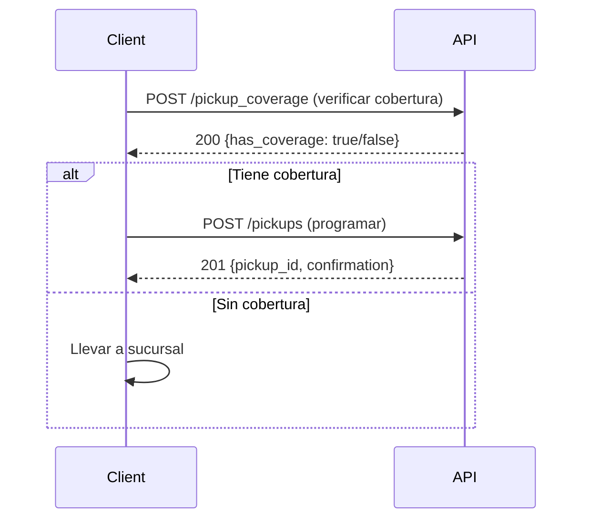

# Recolecciones - Skydropx API

## Resumen

Las recolecciones (pickups) permiten programar que una paquetería recoja tus envíos en tu domicilio u oficina. No todas las paqueterías ni todas las zonas tienen servicio de recolección disponible.

## Flujo de Recolección



---

## Endpoints

### 1. Verificar Cobertura de Recolección

Verifica si hay servicio de recolección en una dirección.

```http
POST /api/v1/pickup_coverage
Authorization: Bearer {token}
Content-Type: application/json
```

#### Body

```json
{
  "zip": "64000",
  "country_code": "MX"
}
```

#### Respuesta (200 OK) - Con Cobertura

```json
{
  "data": {
    "has_coverage": true,
    "available_carriers": [
      {
        "carrier_code": "fedex",
        "carrier_name": "FedEx",
        "pickup_types": ["same_day", "next_day"],
        "cutoff_time": "15:00",
        "min_packages": 1,
        "max_packages": 20,
        "cost": 0.00
      },
      {
        "carrier_code": "dhl",
        "carrier_name": "DHL",
        "pickup_types": ["next_day"],
        "cutoff_time": "14:00",
        "min_packages": 1,
        "max_packages": 10,
        "cost": 50.00
      }
    ]
  }
}
```

#### Respuesta (200 OK) - Sin Cobertura

```json
{
  "data": {
    "has_coverage": false,
    "message": "No hay servicio de recolección disponible en esta zona",
    "alternatives": [
      "Llevar a sucursal",
      "Verificar cobertura en código postal cercano"
    ]
  }
}
```

---

### 2. Crear Recolección

Programa una recolección para uno o más envíos.

```http
POST /api/v1/pickups
Authorization: Bearer {token}
Content-Type: application/json
```

#### Body Mínimo

```json
{
  "pickup": {
    "address": {
      "name": "Juan Pérez",
      "street1": "Av. Constitución 123",
      "zip": "64000",
      "country_code": "MX",
      "phone": "8112345678",
      "email": "juan@empresa.com"
    },
    "pickup_date": "2024-01-20",
    "pickup_time_from": "09:00",
    "pickup_time_to": "13:00",
    "shipment_ids": [
      "93774c22-8275-4757-9963-71b79b2e8db7"
    ]
  }
}
```

#### Body Completo

```json
{
  "pickup": {
    "carrier_code": "fedex",
    "pickup_type": "same_day",
    
    "address": {
      "name": "Juan Pérez Gómez",
      "company": "Mi Empresa SA de CV",
      "street1": "Av. Constitución 123",
      "street2": "Piso 4, Oficina 401",
      "city": "Monterrey",
      "province": "Nuevo León",
      "zip": "64000",
      "country_code": "MX",
      "phone": "8112345678",
      "email": "juan.perez@miempresa.com",
      "reference": "Edificio azul, entrada por estacionamiento"
    },
    
    "pickup_date": "2024-01-20",
    "pickup_time_from": "09:00",
    "pickup_time_to": "13:00",
    
    "shipment_ids": [
      "93774c22-8275-4757-9963-71b79b2e8db7",
      "a1b2c3d4-e5f6-7890-abcd-ef1234567890"
    ],
    
    "total_packages": 2,
    "total_weight": 5.5,
    
    "instructions": "Tocar en recepción, preguntar por Juan",
    "ready_time": "09:00",
    "close_time": "18:00"
  }
}
```

#### Respuesta (201 Created)

```json
{
  "data": {
    "id": "pk_abc123xyz789",
    "type": "pickups",
    "attributes": {
      "status": "scheduled",
      "carrier_code": "fedex",
      "carrier_name": "FedEx",
      "confirmation_number": "FEDEX-20240120-001",
      "pickup_date": "2024-01-20",
      "pickup_time_from": "09:00",
      "pickup_time_to": "13:00",
      "total_packages": 2,
      "total_weight": 5.5,
      "cost": 0.00,
      "created_at": "2024-01-19T15:30:00.000Z"
    },
    "relationships": {
      "shipments": {
        "data": [
          {"id": "93774c22-8275-4757-9963-71b79b2e8db7", "type": "shipments"},
          {"id": "a1b2c3d4-e5f6-7890-abcd-ef1234567890", "type": "shipments"}
        ]
      }
    }
  }
}
```

---

### 3. Obtener Recolecciones

Lista todas las recolecciones.

```http
GET /api/v1/pickups?page=1&per_page=20&status=scheduled
Authorization: Bearer {token}
```

#### Parámetros de Query

| Parámetro | Tipo | Descripción |
|-----------|------|-------------|
| `page` | integer | Número de página |
| `per_page` | integer | Resultados por página (max 100) |
| `status` | string | Filtrar por estado |
| `pickup_date_from` | date | Desde fecha (YYYY-MM-DD) |
| `pickup_date_to` | date | Hasta fecha (YYYY-MM-DD) |
| `carrier_code` | string | Filtrar por paquetería |

#### Respuesta (200 OK)

```json
{
  "data": [
    {
      "id": "pk_abc123xyz789",
      "type": "pickups",
      "attributes": {
        "status": "scheduled",
        "carrier_code": "fedex",
        "confirmation_number": "FEDEX-20240120-001",
        "pickup_date": "2024-01-20",
        "total_packages": 2
      }
    }
  ],
  "meta": {
    "total_pages": 3,
    "total_count": 45,
    "current_page": 1,
    "per_page": 20
  }
}
```

---

### 4. Obtener Recolección por ID

Obtiene los detalles de una recolección específica.

```http
GET /api/v1/pickups/{id}
Authorization: Bearer {token}
```

#### Respuesta (200 OK)

Similar a la respuesta de crear recolección.

---

### 5. Reprogramar Recolección

Cambia la fecha/hora de una recolección existente.

```http
PUT /api/v1/pickups/{id}/reschedule
Authorization: Bearer {token}
Content-Type: application/json
```

#### Body

```json
{
  "pickup_date": "2024-01-22",
  "pickup_time_from": "10:00",
  "pickup_time_to": "14:00",
  "reason": "Cliente no disponible en fecha original"
}
```

#### Respuesta (200 OK)

```json
{
  "data": {
    "id": "pk_abc123xyz789",
    "type": "pickups",
    "attributes": {
      "status": "rescheduled",
      "pickup_date": "2024-01-22",
      "pickup_time_from": "10:00",
      "pickup_time_to": "14:00",
      "previous_pickup_date": "2024-01-20"
    }
  }
}
```

---

### 6. Cancelar Recolección

Cancela una recolección programada.

```http
POST /api/v1/pickups/{id}/cancel
Authorization: Bearer {token}
Content-Type: application/json
```

#### Body

```json
{
  "reason": "Envíos ya fueron entregados en sucursal"
}
```

#### Respuesta (200 OK)

```json
{
  "data": {
    "id": "pk_abc123xyz789",
    "type": "pickups",
    "attributes": {
      "status": "cancelled",
      "cancellation_reason": "Envíos ya fueron entregados en sucursal"
    }
  }
}
```

---

## Campos de Dirección

| Campo | Tipo | Requerido | Descripción |
|-------|------|-----------|-------------|
| `name` | string | ✅ | Nombre del contacto |
| `company` | string | ❌ | Nombre de empresa |
| `street1` | string | ✅ | Calle y número |
| `street2` | string | ❌ | Datos adicionales |
| `city` | string | ❌ | Ciudad |
| `province` | string | ❌ | Estado |
| `zip` | string | ✅ | Código postal |
| `country_code` | string | ✅ | Código ISO país |
| `phone` | string | ✅ | Teléfono |
| `email` | string | ✅ | Email |
| `reference` | string | ❌ | Referencias |

---

## Estados de Recolección

| Estado | Descripción |
|--------|-------------|
| `pending` | Recolección solicitada |
| `scheduled` | Recolección confirmada |
| `in_progress` | Mensajero en camino |
| `completed` | Paquetes recolectados |
| `failed` | Intento fallido |
| `rescheduled` | Reprogramada |
| `cancelled` | Cancelada |

---

## Tipos de Recolección

| Tipo | Descripción | Disponibilidad |
|------|-------------|----------------|
| `same_day` | Mismo día | Antes del cutoff time |
| `next_day` | Día siguiente | Cualquier hora |
| `scheduled` | Fecha programada | Con anticipación |

---

## Ejemplos de Uso

### JavaScript - Verificar Cobertura

```javascript
const client = new SkydropxClient({...});
await client.authenticate();

const coverage = await client.getPickupCoverage('64000', 'MX');

if (coverage.data.has_coverage) {
  console.log('✅ Hay servicio de recolección');
  coverage.data.available_carriers.forEach(carrier => {
    console.log(`${carrier.carrier_name}:`);
    console.log(`  Tipos: ${carrier.pickup_types.join(', ')}`);
    console.log(`  Hora límite: ${carrier.cutoff_time}`);
    console.log(`  Costo: $${carrier.cost}`);
  });
} else {
  console.log('❌ Sin cobertura de recolección');
}
```

### JavaScript - Programar Recolección

```javascript
// Crear envíos primero
const shipment1 = await client.createShipment({...});
const shipment2 = await client.createShipment({...});

// Programar recolección para mañana
const tomorrow = new Date();
tomorrow.setDate(tomorrow.getDate() + 1);
const pickupDate = tomorrow.toISOString().split('T')[0];

const pickup = await client.createPickup({
  address: {
    name: 'Juan Pérez',
    street1: 'Av. Constitución 123',
    zip: '64000',
    country_code: 'MX',
    phone: '8112345678',
    email: 'juan@empresa.com',
    reference: 'Edificio azul'
  },
  pickup_date: pickupDate,
  pickup_time_from: '09:00',
  pickup_time_to: '13:00',
  shipment_ids: [
    shipment1.data.id,
    shipment2.data.id
  ],
  instructions: 'Tocar en recepción'
});

console.log('✅ Recolección programada');
console.log('Confirmación:', pickup.data.attributes.confirmation_number);
console.log('Fecha:', pickup.data.attributes.pickup_date);
```

### JavaScript - Reprogramar

```javascript
const updated = await client.reschedulePickup(
  'pk_abc123xyz789',
  {
    pickup_date: '2024-01-22',
    pickup_time_from: '10:00',
    pickup_time_to: '14:00',
    reason: 'Cliente no disponible'
  }
);

console.log('Recolección reprogramada para:', updated.data.attributes.pickup_date);
```

### cURL - Verificar Cobertura

```bash
curl -X POST 'https://app.skydropx.com/api/v1/pickup_coverage' \
  -H 'Authorization: Bearer YOUR_TOKEN' \
  -H 'Content-Type: application/json' \
  -d '{
    "zip": "64000",
    "country_code": "MX"
  }'
```

---

## Horarios de Recolección

### Cutoff Times Típicos

| Paquetería | Cutoff Same Day | Cutoff Next Day |
|------------|-----------------|-----------------|
| FedEx | 15:00 | 18:00 |
| DHL | 14:00 | 17:00 |
| Estafeta | 15:00 | 18:00 |
| UPS | 14:30 | 17:30 |

⚠️ Los horarios varían según la zona. Usa el endpoint de cobertura para horarios exactos.

---

## Mejores Prácticas

### ✅ Recomendado

- **Verificar cobertura**: Siempre verifica antes de programar
- **Ventanas amplias**: Usa ventanas de 4 horas mínimo
- **Contacto disponible**: Asegura que alguien esté presente
- **Referencias claras**: Facilita la ubicación del mensajero
- **Programar temprano**: Programa antes del cutoff time
- **Confirmación**: Guarda el número de confirmación

### ❌ Evitar

- **Programar sin cobertura**: Verificar siempre primero
- **Ventanas muy cortas**: Mínimo 3-4 horas
- **Días festivos**: Verificar disponibilidad
- **Direcciones incompletas**: Incluye referencias
- **Sin contacto**: Asegura disponibilidad telefónica

---

## Costos de Recolección

| Paquetería | Recolecciones Gratis | Costo Adicional |
|------------|---------------------|-----------------|
| FedEx | Sí (con envíos FedEx) | $0 |
| DHL | No | $50 - $100 |
| Estafeta | Sí (mínimo 2 paquetes) | $0 |
| UPS | Sí (envíos UPS) | $0 |

Los costos varían según acuerdos comerciales. Consulta en el endpoint de cobertura.

---

## Restricciones Comunes

### Por Paquetería

- **Mínimo de paquetes**: 1-2 paquetes según paquetería
- **Máximo de paquetes**: 10-20 paquetes por recolección
- **Peso máximo**: 50-70 kg por paquete
- **Dimensiones máximas**: 150 cm suma de lados

### Por Zona

- Algunas zonas solo tienen recolección con cita
- Zonas rurales pueden tener restricciones
- Horarios limitados en fines de semana

---

## Alternativas sin Cobertura

Si no hay servicio de recolección:

1. **Llevar a sucursal**: Busca sucursales cercanas
2. **Recolección programada**: Agenda con más anticipación
3. **Código postal cercano**: Intenta con CP de zona cercana con cobertura
4. **Paquetería diferente**: Algunas tienen mejor cobertura en ciertas zonas

---

## Errores Comunes

| Error | Causa | Solución |
|-------|-------|----------|
| `no_coverage` | Sin servicio en la zona | Llevar a sucursal o cambiar CP |
| `past_cutoff` | Después de hora límite | Programar para día siguiente |
| `invalid_date` | Fecha pasada o día festivo | Usar fecha válida |
| `min_packages_not_met` | Pocos paquetes | Agregar más envíos o llevar a sucursal |
| `shipment_not_found` | ID de envío inválido | Verificar IDs de envíos |

---

## Webhooks

Recibe notificaciones de cambios en recolecciones:

```json
{
  "event": "pickup.status.updated",
  "data": {
    "id": "pk_abc123xyz789",
    "status": "completed",
    "confirmation_number": "FEDEX-20240120-001",
    "packages_collected": 2
  }
}
```

---

## Recursos

- [Ejemplo de Recolección](../examples/pickups/schedule-pickup.js)
- [Documentación de Envíos](SHIPMENTS.md)
- [Sucursales de Paqueterías](https://help.skydropx.com/articulos/sucursales)

---

## Soporte

¿Problemas con recolecciones?
- 📧 Email: recolecciones@skydropx.com
- 📱 WhatsApp: +52 81 xxxx xxxx
- 📚 Ayuda: https://help.skydropx.com
