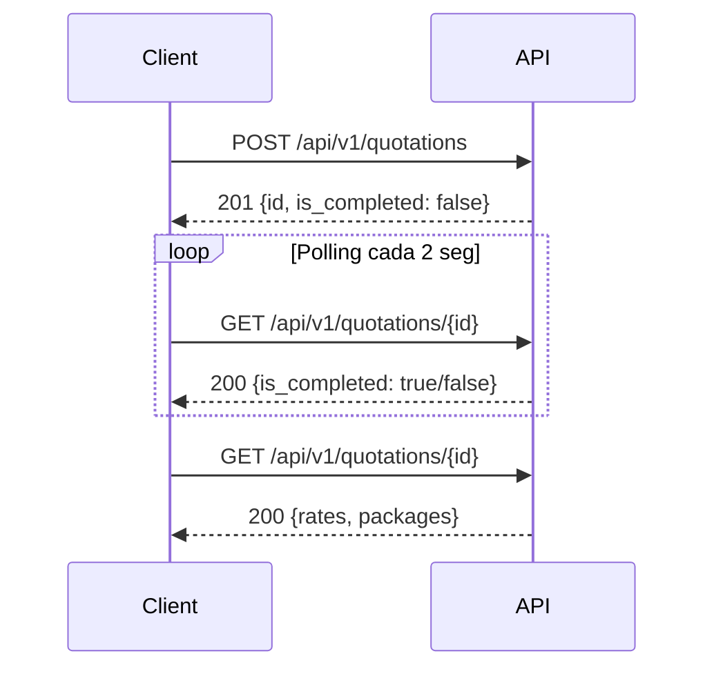

# Cotizaciones - Skydropx API

## Resumen

Las cotizaciones permiten comparar tarifas de múltiples paqueterías antes de crear un envío. El proceso es asíncrono: primero creas la cotización, luego esperas a que se procese y obtienes las tarifas disponibles.

## Flujo de Cotización



---

## Endpoints

### 1. Crear Cotización

Crea una nueva cotización para obtener tarifas de paqueterías.

```http
POST /api/v1/quotations
Authorization: Bearer {token}
Content-Type: application/json
```

#### Body - Cotización Nacional

```json
{
  "quotation": {
    "address_from": {
      "country_code": "MX",
      "postal_code": "64000",
      "area_level1": "Nuevo León",
      "area_level2": "Monterrey",
      "area_level3": "Centro"
    },
    "address_to": {
      "country_code": "MX",
      "postal_code": "01000",
      "area_level1": "Ciudad de México",
      "area_level2": "Álvaro Obregón",
      "area_level3": "Santa Fe"
    },
    "packages": [
      {
        "weight": 2.5,
        "length": 30,
        "width": 20,
        "height": 15
      }
    ]
  }
}
```

#### Body - Cotización Internacional

```json
{
  "quotation": {
    "address_from": {
      "country_code": "MX",
      "postal_code": "64000",
      "area_level1": "Nuevo León",
      "area_level2": "Monterrey",
      "area_level3": "Centro"
    },
    "address_to": {
      "country_code": "US",
      "postal_code": "10001",
      "area_level1": "New York",
      "area_level2": "New York",
      "area_level3": "Manhattan"
    },
    "packages": [
      {
        "weight": 2.5,
        "length": 30,
        "width": 20,
        "height": 15,
        "declared_value": 100.00
      }
    ],
    "products": [
      {
        "name": "Laptop",
        "sku": "LAP-001",
        "hs_code": "8471.30.01",
        "quantity": 1,
        "price": 100.00,
        "weight": 2.5
      }
    ]
  }
}
```

#### Respuesta (201 Created)

```json
{
  "id": "dde96439-67a9-41ec-90ed-af7f4ca2cec9",
  "is_completed": false,
  "quotation_scope": {
    "carriers_scoped_to": "ALL_AVAILABLE"
  }
}
```

---

### 2. Obtener Cotización

Obtiene el estado y resultados de una cotización.

```http
GET /api/v1/quotations/{id}
Authorization: Bearer {token}
```

#### Respuesta (200 OK) - Completa

```json
{
  "id": "dde96439-67a9-41ec-90ed-af7f4ca2cec9",
  "is_completed": true,
  "quotation_scope": {
    "carriers_scoped_to": "ALL_AVAILABLE"
  },
  "rates": [
    {
      "id": "938f6079-e608-4baa-b9b5-8be7f4de0535",
      "success": true,
      "rate_type": "default",
      "provider_name": "fedex",
      "provider_display_name": "FedEx",
      "provider_service_name": "Express Saver",
      "provider_service_code": "fedex_express_saver",
      "status": "price_found_external",
      "currency_code": "MXN",
      "amount": "228.11",
      "total": "246.74",
      "service_fee": 15.00,
      "weight": 2.5,
      "days": 1,
      "insurable": true,
      "zone": "1",
      "pickup": true,
      "pickup_automatic": false,
      "pickup_package_min": 1,
      "pickup_ocurre": true,
      "extra_fees": [
        {
          "code": "FUEL_SURCHARGE_FEE",
          "value": "18.63"
        }
      ]
    }
  ],
  "packages": [
    {
      "package_number": 1,
      "weight": "2.5",
      "length": "30.0",
      "width": "20.0",
      "height": "15.0"
    }
  ]
}
```

---

## Parámetros de Entrada

### address_from / address_to

| Campo | Tipo | Requerido | Descripción |
|-------|------|-----------|-------------|
| `country_code` | string | ✅ | Código ISO del país (MX, US, etc) |
| `postal_code` | string | ✅ | Código postal |
| `area_level1` | string | ✅ | Estado/Provincia |
| `area_level2` | string | ✅ | Ciudad/Municipio |
| `area_level3` | string | ✅ | Colonia/Barrio |

### packages

| Campo | Tipo | Requerido | Descripción |
|-------|------|-----------|-------------|
| `weight` | float | ✅ | Peso en kilogramos |
| `length` | float | ✅ | Largo en centímetros |
| `width` | float | ✅ | Ancho en centímetros |
| `height` | float | ✅ | Alto en centímetros |
| `declared_value` | float | ❌* | Valor declarado (*requerido para internacional) |

### products (Solo Internacional)

| Campo | Tipo | Requerido | Descripción |
|-------|------|-----------|-------------|
| `name` | string | ✅ | Nombre del producto |
| `sku` | string | ❌ | Código del producto |
| `hs_code` | string | ✅ | Código arancelario HS |
| `quantity` | integer | ✅ | Cantidad de productos |
| `price` | float | ✅ | Precio unitario |
| `weight` | float | ✅ | Peso en kg |

---

## Información de Tarifas

### Campos de Rate

| Campo | Descripción |
|-------|-------------|
| `id` | ID único de la tarifa (usar para crear envío) |
| `provider_name` | Identificador interno de la paquetería |
| `provider_display_name` | Nombre comercial de la paquetería |
| `provider_service_name` | Nombre del servicio |
| `amount` | Costo base |
| `total` | Costo total (incluye fees) |
| `service_fee` | Tarifa de gestión de Skydropx |
| `days` | Días estimados de entrega |
| `zone` | Zona de servicio |
| `pickup` | Si soporta recolección |
| `insurable` | Si se puede asegurar |

### Estados de Rate

| Estado | Descripción |
|--------|-------------|
| `pending` | Esperando respuesta de la paquetería |
| `approved` | Tarifa encontrada y aprobada |
| `price_found_external` | Precio obtenido de API externa |
| `price_found_internal` | Precio de tarifa interna |
| `no_coverage` | Sin cobertura para la ruta |
| `not_applicable` | Servicio no aplicable |

---

## Ejemplos de Uso

### JavaScript - Cotización Simple

```javascript
const client = new SkydropxClient({...});
await client.authenticate();

// Crear cotización
const quotation = await client.createQuotation({
  address_from: {
    country_code: 'MX',
    postal_code: '64000',
    area_level1: 'Nuevo León',
    area_level2: 'Monterrey',
    area_level3: 'Centro'
  },
  address_to: {
    country_code: 'MX',
    postal_code: '01000',
    area_level1: 'Ciudad de México',
    area_level2: 'Álvaro Obregón',
    area_level3: 'Santa Fe'
  },
  packages: [{
    weight: 2.5,
    length: 30,
    width: 20,
    height: 15
  }]
});

// Esperar a que complete (polling)
let result;
do {
  await sleep(2000);
  result = await client.getQuotation(quotation.id);
} while (!result.is_completed);

// Obtener mejores tarifas
const rates = result.rates
  .filter(r => r.success)
  .sort((a, b) => parseFloat(a.total) - parseFloat(b.total));

console.log('Mejor tarifa:', rates[0].provider_display_name, rates[0].total);
```

### cURL - Crear Cotización

```bash
# 1. Crear cotización
curl -X POST 'https://app.skydropx.com/api/v1/quotations' \
  -H 'Authorization: Bearer YOUR_TOKEN' \
  -H 'Content-Type: application/json' \
  -d '{
    "quotation": {
      "address_from": {
        "country_code": "MX",
        "postal_code": "64000",
        "area_level1": "Nuevo León",
        "area_level2": "Monterrey",
        "area_level3": "Centro"
      },
      "address_to": {
        "country_code": "MX",
        "postal_code": "01000",
        "area_level1": "Ciudad de México",
        "area_level2": "Álvaro Obregón",
        "area_level3": "Santa Fe"
      },
      "packages": [{
        "weight": 2.5,
        "length": 30,
        "width": 20,
        "height": 15
      }]
    }
  }'

# 2. Obtener resultados (esperar 5-10 segundos)
curl -X GET 'https://app.skydropx.com/api/v1/quotations/QUOTATION_ID' \
  -H 'Authorization: Bearer YOUR_TOKEN'
```

---

## Filtrado de Paqueterías

Puedes especificar qué paqueterías cotizar:

```json
{
  "quotation": {
    "carriers": ["fedex", "dhl", "estafeta"],
    "address_from": {...},
    "address_to": {...},
    "packages": [...]
  }
}
```

### Códigos de Paqueterías

| Código | Paquetería |
|--------|------------|
| `fedex` | FedEx |
| `dhl` | DHL |
| `estafeta` | Estafeta |
| `sendex` | Sendex |
| `redpack` | Redpack |
| `ups` | UPS |
| `paquetexpress` | PaquetExpress |
| `99minutos` | 99 Minutos |

---

## Mejores Prácticas

### ✅ Recomendado

- **Polling inteligente**: Espera 2-3 segundos entre cada consulta
- **Timeout**: Establece un máximo de 30 segundos de espera
- **Cache**: Guarda cotizaciones por 30 minutos
- **Comparación**: Considera precio, días y servicios adicionales
- **Redondeo**: Redondea dimensiones hacia arriba

### ❌ Evitar

- **Polling agresivo**: No consultes más de 1 vez por segundo
- **Cotizaciones innecesarias**: Reutiliza cotizaciones recientes
- **Dimensiones exactas**: Siempre redondea hacia arriba para evitar rechazos

---

## Códigos de Error

| Código | Error | Solución |
|--------|-------|----------|
| 400 | Datos inválidos | Verifica formato de direcciones y paquetes |
| 404 | Cotización no encontrada | Verifica el ID de la cotización |
| 422 | Validación fallida | Revisa que todos los campos requeridos estén presentes |

---

## Recursos

- [Ejemplo Completo](../../examples/quotations/create-quotation.js)
- [Códigos de Paquetería](https://help.skydropx.com/articulos-cda/conoce-los-codigos-para-crear-tus-guias)
- [Crear Envío desde Cotización](SHIPMENTS.md)
